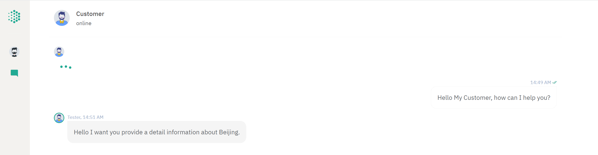

Tripsier is a user-friendly, secure and robust website, that enables the local Travel
Agent to provide their customers with a simple and intuitive interface that guides users to browse,
plan and book for their trips, and the staffs with a friendly interface to manage operations in the
company. For detailed information please refer to Technical Documentation and User Manual.
# User

# Admin

